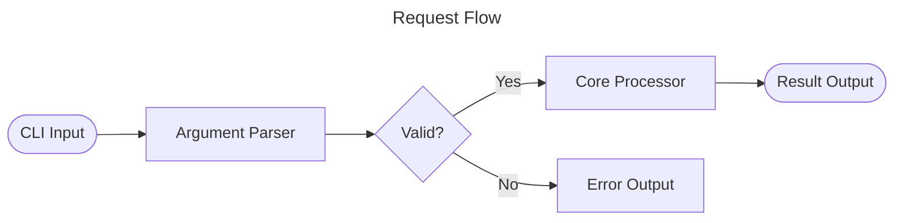
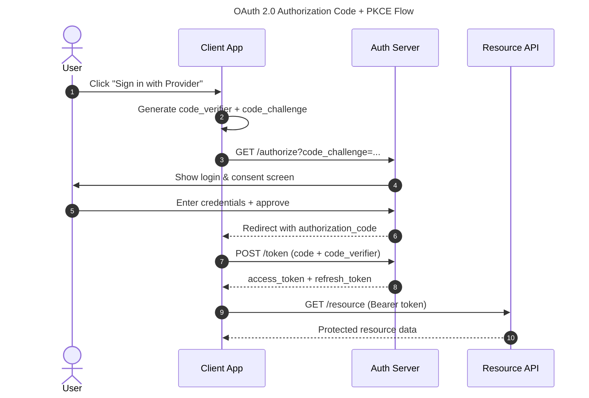
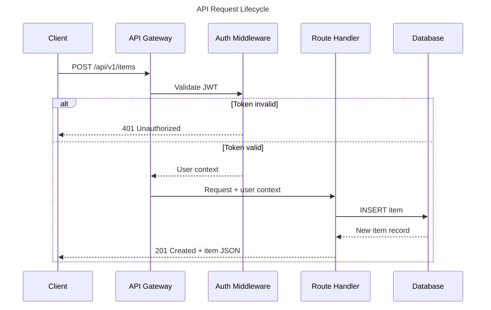
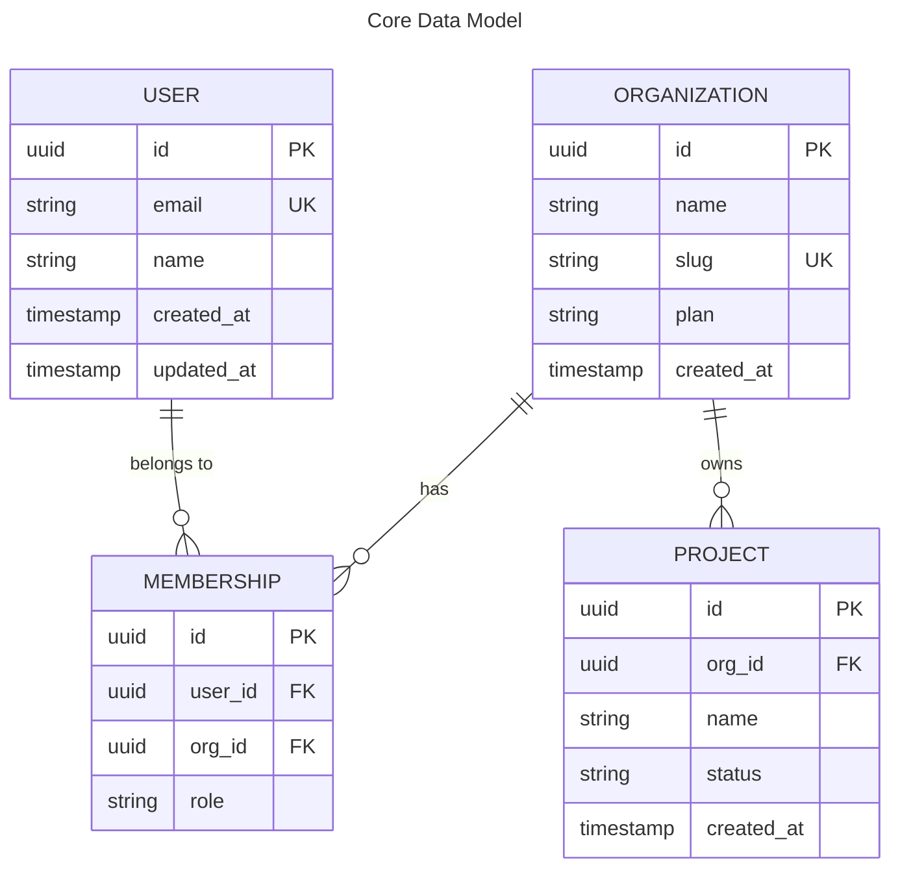
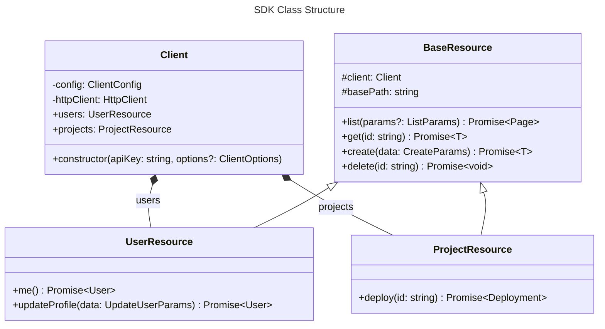
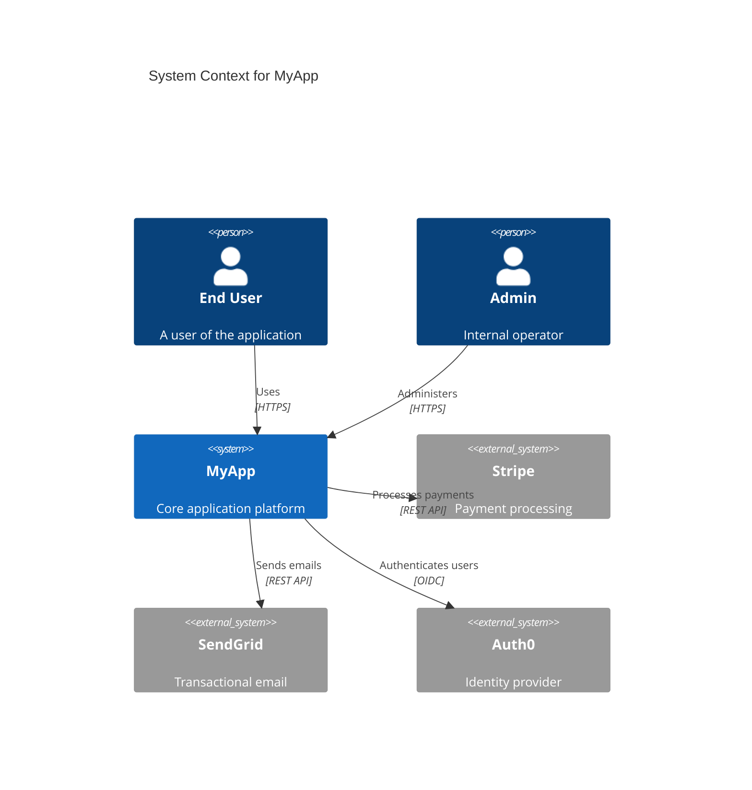
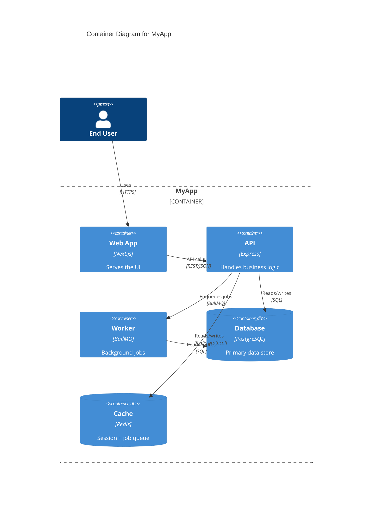
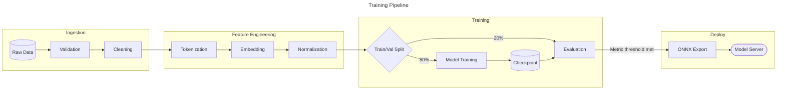
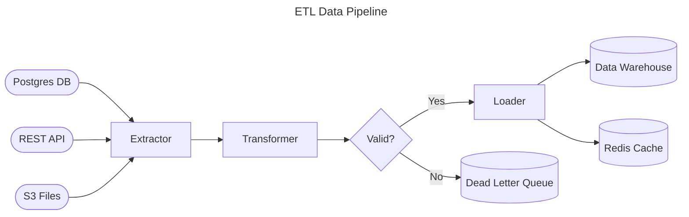
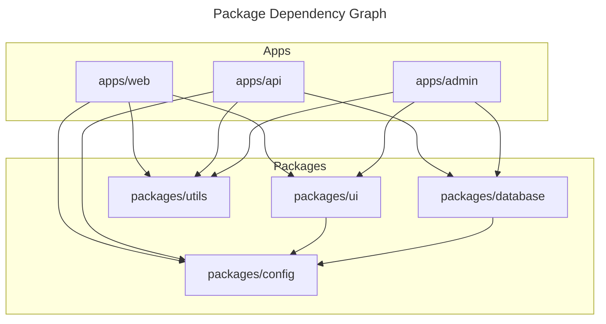

# Mermaid Diagram Patterns

Concrete, working Mermaid syntax patterns for READMEs. All patterns are validated for
GitHub rendering (Mermaid v11.4.1 as of 2025). Read this during Phase 4.

---

## Table of Contents

1. [Rendering Rules & Hard Constraints](#1-rendering-rules--hard-constraints)
2. [Flowchart — Architecture & Data Flow](#2-flowchart--architecture--data-flow)
3. [Sequence Diagram — API & Auth Flows](#3-sequence-diagram--api--auth-flows)
4. [ER Diagram — Data Models](#4-er-diagram--data-models)
5. [Class Diagram — SDK & Library Structure](#5-class-diagram--sdk--library-structure)
6. [Git Graph — Branching Models](#6-git-graph--branching-models)
7. [C4 Diagrams — System Context & Containers](#7-c4-diagrams--system-context--containers)
8. [Pipeline / Data Flow — ML & ETL](#8-pipeline--data-flow--ml--etl)
9. [Monorepo Dependency Graph](#9-monorepo-dependency-graph)
10. [Anti-Patterns to Avoid](#10-anti-patterns-to-avoid)

---

## 1. Rendering Rules & Hard Constraints

### What renders on GitHub (rock-solid)
- `flowchart` (TD, LR, BT, RL)
- `sequenceDiagram`
- `erDiagram`
- `classDiagram`
- `gitGraph`
- `stateDiagram-v2`
- `pie`, `mindmap`, `timeline`, `quadrantChart`
- `C4Context`, `C4Container`, `C4Component` (native, marked experimental)

### What does NOT render on GitHub
- `architecture-beta` — requires icon pack registration, not available in GitHub sandbox
- `kanban` — too new
- `packet` — too new
- Any diagram using Font Awesome icons
- Click events, tooltips, hyperlinks within diagram nodes

### Hard rules — violating these breaks diagrams

1. **NEVER set a `theme` directive.** This overrides GitHub's auto dark/light theming:
   ```
   %%{init: {"theme": "dark"}}%%   ← BREAKS dark mode, do not use
   ```
   Use `themeVariables` for color customization if needed, but leave `theme` unset.

2. **Max 20 nodes per diagram.** GitHub renders in fixed-width containers. Beyond 20 nodes,
   readability collapses. Split complex systems into multiple focused diagrams.

3. **Always add title and accessibility metadata:**
   ```
   ---
   title: My Diagram Title
   ---
   accDescr: Brief description of what this diagram shows
   flowchart TD
       ...
   ```

4. **Use `flowchart`, not deprecated `graph`:**
   ```
   flowchart TD    ← correct
   graph TD        ← deprecated, still works but avoid
   ```

5. **Escape special characters in node labels.** Parentheses, quotes, and angle brackets
   break rendering:
   ```
   A["Process (item)"]     ← quotes around label for parens
   B["Filter &lt;data&gt;"] ← HTML escape for < >
   ```

6. **Embed in code fences with `mermaid` language hint:**
   ````markdown
   ```mermaid
   flowchart TD
       ...
   ```
   ````

---

## 2. Flowchart — Architecture & Data Flow

### Node Shapes

| Syntax | Shape | Use for |
|---|---|---|
| `A[text]` | Rectangle | Generic process/service |
| `A[(text)]` | Cylinder | Database, storage |
| `A([text])` | Stadium | External service, API |
| `A{text}` | Diamond | Decision point |
| `A>text]` | Asymmetric | Event, message |
| `A((text))` | Circle | Start/end |
| `A[[text]]` | Subroutine | Subprocess |

### Link Types

| Syntax | Renders as | Use for |
|---|---|---|
| `A --> B` | Arrow | Synchronous call |
| `A -.-> B` | Dotted arrow | Async, optional, event |
| `A ==> B` | Thick arrow | Primary/critical path |
| `A --- B` | Line (no arrow) | Association |
| `A -->|label| B` | Labeled arrow | Named relationships |

### Three-Tier SaaS Architecture Example

```mermaid
---
title: System Architecture
---
accDescr: Three-tier architecture showing client, API gateway, services, and data stores
flowchart TD
    subgraph Client["Client Layer"]
        WEB([Web App])
        MOB([Mobile App])
    end

    subgraph API["API Layer"]
        GW[API Gateway]
        AUTH[Auth Service]
    end

    subgraph Services["Service Layer"]
        US[User Service]
        PS[Payment Service]
        NS[Notification Service]
    end

    subgraph Data["Data Layer"]
        DB[(PostgreSQL)]
        CACHE[(Redis)]
        QUEUE[(Message Queue)]
    end

    WEB --> GW
    MOB --> GW
    GW --> AUTH
    GW --> US
    GW --> PS
    PS -.-> QUEUE
    QUEUE -.-> NS
    US --> DB
    US --> CACHE
    PS --> DB
```

### Simple Two-Component Example (for small projects)



---

## 3. Sequence Diagram — API & Auth Flows

### Core Syntax

```
sequenceDiagram
    actor User           ← human actor (stick figure icon)
    participant App      ← service (rectangle)
    participant Auth as Auth Service   ← alias

    User ->> App: HTTP POST /login
    App ->> Auth: Validate credentials
    Auth -->> App: JWT token
    App -->> User: 200 OK + Set-Cookie
```

Arrow types:
- `->>` solid arrow (synchronous call)
- `-->>` dashed arrow (response/return)
- `-x` solid with X (failed/error)
- `--x` dashed with X (failed response)

### OAuth 2.0 / PKCE Flow Example



### REST API Request Lifecycle Example



---

## 4. ER Diagram — Data Models

### Cardinality Notation

| Notation | Meaning |
|---|---|
| `\|\|` | Exactly one |
| `o\|` | Zero or one |
| `\|\{` | One or many |
| `o\{` | Zero or many (most common for "has many") |

### Full Example — SaaS Data Model



---

## 5. Class Diagram — SDK & Library Structure

### Core Syntax

```
classDiagram
    class ClassName {
        +publicField: Type
        -privateField: Type
        #protectedField: Type
        +publicMethod(arg: Type) ReturnType
        -privateMethod() void
    }
    ClassName <|-- SubClass      ← inheritance
    ClassName *-- Component      ← composition
    ClassName o-- Associated     ← aggregation
    ClassName --> Dependency     ← dependency
    ClassName ..|> Interface     ← realization
```

### SDK Client Example



---

## 6. Git Graph — Branching Models

### Core Syntax

```
gitGraph
    commit
    branch feature/my-feature
    checkout feature/my-feature
    commit id: "Add feature"
    commit id: "Add tests"
    checkout main
    merge feature/my-feature
    commit id: "v1.2.0" tag: "v1.2.0"
```

### Trunk-Based Development Example


---

## 7. C4 Diagrams — System Context & Containers

C4 diagrams are natively built into Mermaid. Marked experimental on GitHub but render
reliably for Context and Container levels. Use for complex SaaS or platform products.

### C4 Context (Level 1 — System in its environment)



### C4 Container (Level 2 — Internal components)



---

## 8. Pipeline / Data Flow — ML & ETL

Use `flowchart LR` (left-to-right) for pipelines — it naturally shows stages flowing forward.

### ML Training Pipeline



### ETL Pipeline



---

## 9. Monorepo Dependency Graph



---

## 10. Anti-Patterns to Avoid

### ❌ Do not use `theme` directives
```
%%{init: {"theme": "dark"}}%%   ← breaks GitHub dark mode
%%{init: {"theme": "forest"}}%% ← overrides auto-theme
```

### ❌ Do not use `architecture-beta`
```
architecture-beta               ← will NOT render on GitHub
    service db(database)[DB]
    ...
```

### ❌ Do not exceed 20 nodes
```
flowchart TD
    A --> B --> C --> D --> E --> F --> G --> H --> I --> J
    J --> K --> L --> M --> N --> O --> P --> Q --> R --> S --> T
    ← 20+ nodes: unreadable in GitHub fixed-width container
```
Solution: split into multiple diagrams (Context → Container → Component, C4 style).

### ❌ Do not use special characters unescaped in labels
```
A[Process (item)]    ← may break
B[Check: valid?]     ← may break
```
Correct:
```
A["Process (item)"]  ← quote the label
B["Check: valid?"]   ← quote the label
```

### ❌ Do not use `graph` (deprecated)
```
graph TD    ← deprecated
flowchart TD ← use this instead
```

### ✅ Always use title frontmatter + accDescr
```mermaid
---
title: Authentication Flow
---
accDescr: Sequence showing user login via OAuth 2.0 PKCE
sequenceDiagram
    ...
```
