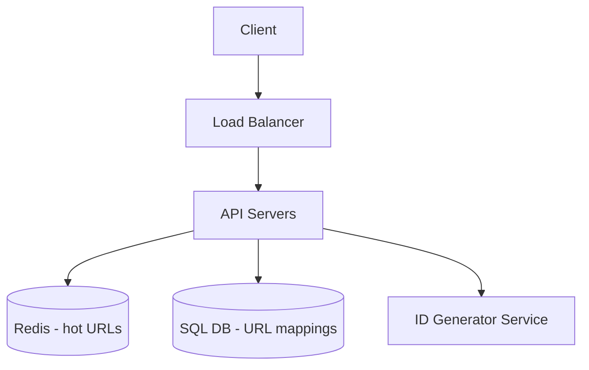
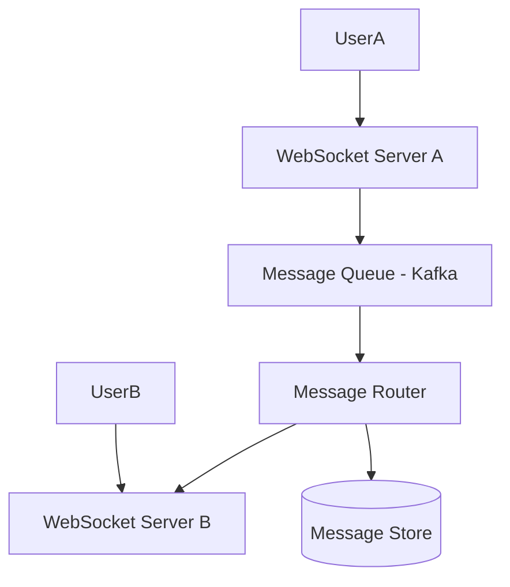
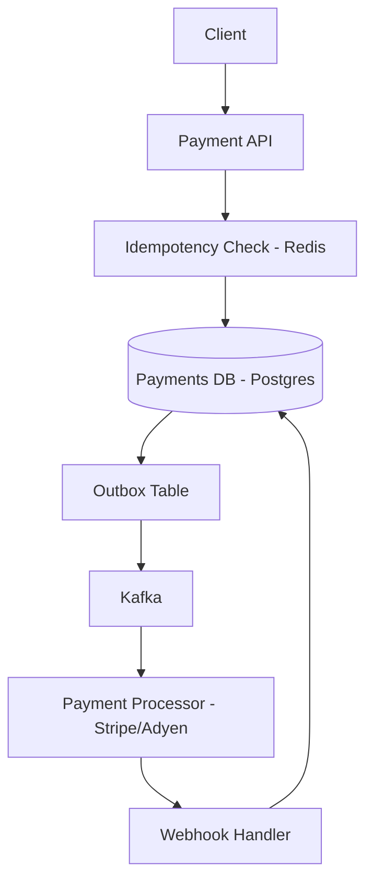

# System Blueprints Reference

Pre-built architectural patterns for the most commonly designed systems.
Use these as starting points, then tailor to the user's specific requirements.

---

## Blueprint 1: URL Shortener (e.g. bit.ly)

**Scale assumptions**: 100M URLs created/day, 10B redirects/day (100:1 read/write)

### Components


### Key Decisions
- **ID generation**: Base62 encode a auto-increment ID (a-z, A-Z, 0-9) → 7 chars = 62^7 = 3.5 trillion URLs
- **DB**: Simple key-value access pattern → Cassandra or DynamoDB works well; PostgreSQL fine at moderate scale
- **Cache**: 80/20 rule — 20% of URLs get 80% of traffic. Cache hot URLs in Redis with TTL
- **Redirect**: 301 (permanent, browser caches) vs 302 (temporary, every request hits server — use for analytics)

### Failure Modes
- ID collision on distributed ID generation → use snowflake IDs or centralized counter with range allocation
- Cache stampede on viral URL → request coalescing + jitter on TTL

---

## Blueprint 2: Social Feed (e.g. Twitter timeline)

**Scale assumptions**: 300M DAU, avg 200 followers, celebrities with 10M+ followers

### Fan-out Strategies

**Fan-out on Write (Push)**
```
User posts tweet → write to all followers' feed caches immediately
Read feed = simple cache lookup, very fast
```
- ✅ Read is O(1)
- ❌ Celeb with 10M followers = 10M cache writes per tweet (write amplification)

**Fan-out on Read (Pull)**
```
User posts tweet → write to their own timeline only
Read feed = fetch followed users' timelines, merge, sort
```
- ✅ Write is cheap
- ❌ Read is expensive (N followed users × DB reads)

**Hybrid (Twitter's actual approach)**
- Regular users → fan-out on write (push to followers' caches)
- Celebrities (>X followers) → fan-out on read (fetched and merged at read time)
- Threshold typically ~10k–100k followers

### Storage
- Tweets: Cassandra (write-heavy, time-series access)
- Social graph (followers): Graph DB or adjacency list in Redis
- Media: S3 + CDN

---

## Blueprint 3: Chat System (e.g. Slack/WhatsApp)

**Scale assumptions**: 50M DAU, avg 40 messages/day, groups up to 500 members

### Real-time Delivery


- **WebSocket** for persistent connections (vs polling)
- **Connection service**: tracks which WS server each user is connected to (store in Redis: user_id → server_id)
- **Message routing**: when User A sends to User B, look up B's server, forward via internal queue

### Message Storage
- Recent messages: Redis (fast access, last 30 days)
- Historical: Cassandra (partitioned by channel_id + time)
- Media: S3 + CDN with presigned URLs

### Delivery Guarantees
- Client sends message → gets ACK with server-assigned message_id
- Server delivers to recipient → recipient sends read receipt
- If recipient offline → store in DB → push notification → deliver on reconnect

### Group Chat Scaling
- Small groups (<100): fan-out to all members' connections directly
- Large groups (100–500): async fan-out via message queue

---

## Blueprint 4: Ride-Sharing (e.g. Uber)

**Scale assumptions**: 5M rides/day, 1M concurrent drivers sending location every 5s

### Location Update Pipeline
```
Driver App → Location Service → Redis Geo (current position)
                              → Kafka → Location History DB
```
- **Redis GeoAdd/GeoRadius**: store and query driver locations within radius
- 1M drivers × 1 update/5s = 200k writes/sec → Redis handles this easily

### Ride Matching
```
Rider requests → Matching Service → query Redis for nearby drivers
                                  → rank by ETA (call Maps API)
                                  → send offer to top N drivers
                                  → first accept wins
```

### Surge Pricing
- Aggregate supply (available drivers) vs demand (ride requests) per geo-cell (H3 hexagons)
- Recalculate every 1–5 minutes per cell
- Store multiplier in Redis, read on every price quote

### Trip State Machine
```
REQUESTED → ACCEPTED → DRIVER_ARRIVING → IN_PROGRESS → COMPLETED → PAID
```
Store in DB with event log for disputes/support

---

## Blueprint 5: Payment System

**Scale assumptions**: 10k TPS peak, zero tolerance for double charges

### Critical Properties
- **Idempotency**: Every payment request must have an idempotency key
- **Exactly-once**: Use DB transactions + outbox pattern
- **Audit log**: Immutable ledger of every state change

### Payment Flow


### Idempotency Key Pattern
```
POST /payments
Headers: Idempotency-Key: client-generated-uuid

Server: 
  if key exists in Redis → return cached response
  else → process payment → cache response with key (TTL: 24h)
```

### Double-Spend Prevention
- Optimistic locking on account balance
- DB constraint: balance >= 0
- Saga pattern for multi-step transfers (debit source → credit destination)

---

## Blueprint 6: Search Autocomplete (e.g. Google search bar)

**Scale assumptions**: 10M DAU, avg 5 searches/session, p99 latency < 100ms

### Trie vs Inverted Index
- **Trie**: Fast prefix lookup, in-memory, great for autocomplete
- **Inverted Index** (Elasticsearch): Full-text search, ranking, fuzzy match

For autocomplete: Trie in Redis or purpose-built (Typesense, Algolia)

### Architecture
```
User types → Debounced request (300ms) → Autocomplete Service
          → Redis Trie lookup → top 10 suggestions by frequency
          → return in < 20ms
```

### Keeping Trie Fresh
- Track search frequency in Kafka stream
- Batch update trie daily (or real-time for trending terms)
- Separate "trending" layer for breaking news / viral queries

---

## Blueprint 7: Video Streaming (e.g. YouTube)

**Scale assumptions**: 500 hours of video uploaded/min, 1B hours watched/day

### Upload Pipeline
```
User uploads → Raw Storage (S3)
             → Transcoding Queue (Kafka)
             → Transcoding Workers (FFmpeg) → Multiple resolutions (360p/720p/1080p/4K)
             → Processed Storage (S3)
             → CDN distribution
             → Metadata DB (title, duration, thumbnails)
```

### Adaptive Bitrate Streaming (ABR)
- Video split into 2–10 second chunks
- Each chunk encoded at multiple bitrates
- Player switches quality based on bandwidth (HLS / DASH protocols)
- CDN serves chunks from edge nodes close to viewer

### View Count (High-Write Counter)
- Don't write to DB on every view — massive write amplification
- Buffer counts in Redis → batch flush to DB every 60s
- Use approximate counting (HyperLogLog) for real-time display
